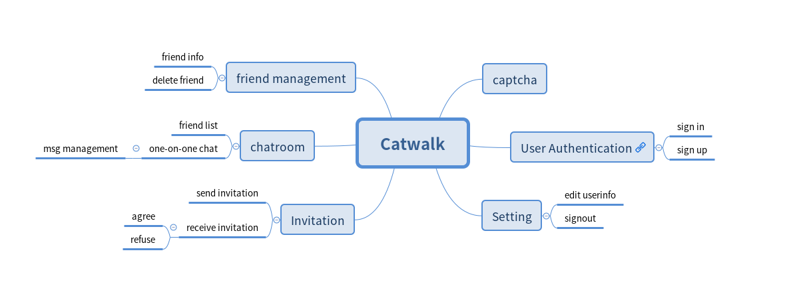

# Catwalk
* Catwalk is a toy (base on beego)
* For me, the object of creating this toy is to study building web application with golang
* As we all known, building web app is not easy. It needs many skills as well as tools.
* Up to now so far, it just implements user authentication(incomplete),  friend management, one-on-one chat

# the skills and tools
* [beego](github.com/astaxie/beego)
* [go-sql-driver/mysql](github.com/go-sql-driver/mysql)
* [gorilla/websocket](github.com/gorilla/websocket)
* [mojocn/base64Captcha](github.com/mojocn/base64Captcha)

# Foreword
* keyword: MVC(Model–view–controller)
* this web app is not complete, there are still many bugs.
 
# models
## Data convention
```golang
/*********************************************************
 * the websocket data between back-end and front-end
 * code represent the type
 * 0: Ivtt(invitation)
 * 1: Rpl(reply)
 * 2: fif(friendinfo)
 * 3: Msg(message)
 * 4: Del(delete friend)
 ********************************************************/
type WsData struct {
  Code int `json:"code"`
  Ivtt JsIvtt `json:"ivtt"`
  Rpl JsRpl `json:"rpl"`
  Fif JsUif `json:"fif"`
  Msg JsMsg `json:"msg"`
  Del JsDel `json:"del"`
}

```

## database(mysql)
```mysql
CREATE TABLE `user` (
	`uid` INT(10) NOT NULL AUTO_INCREMENT,
	`username` VARCHAR(64) NOT NULL UNIQUE,
	`password` BLOB NOT NULL,
	`isactive` INT(1),
	PRIMARY KEY (`uid`)
);

CREATE TABLE `userinfo` (
	`username` VARCHAR(64) NOT NULL,
	`nickname` VARCHAR(64) UNIQUE,
	`email` VARCHAR(255) UNIQUE,
	`motto` VARCHAR(255),
	`icon` BLOB,
	PRIMARY KEY(`username`)
);

--sender and receiver should be username
CREATE TABLE `invitation` (
	`iid` INT(10) NOT NULL AUTO_INCREMENT,
	`sender` VARCHAR(64) NOT NULL,
	`receiver` VARCHAR(64) NOT NULL,
	`msg` VARCHAR(255),
	PRIMARY KEY(`iid`)
);

CREATE TABLE `friendlist` (
	`fid` INT(10) NOT NULL AUTO_INCREMENT,
	`username` VARCHAR(64) NOT NULL,
	`friusername` VARCHAR(64) NOT NULL,
	PRIMARY KEY(`fid`)
);

CREATE TABLE `msg` (
	`mid` INT(10) NOT NULL AUTO_INCREMENT,
	`sender` VARCHAR(64) NOT NULL,
	`receiver` VARCHAR(64) NOT NULL,
	`content` TEXT NOT NULL,
	`sendtime` DATETIME NOT NULL,
	PRIMARY KEY(`mid`) 
);
```
## orm Models
* define the struct to handle database data
* more: [ormModels.go](models/ormModels.go)

##JSON models
* holder: 
```golang
var CwJSON *CwJSONModel
```
* define the struct to handle the data from front-end
* including marshal and unmarhal function
* more: [jsonModels.go](models/jsonModels.go)

## CRUD Models
* holder:
```golang
var Crud CrudModel
```
* define the function to handle database problem
* more: [crudModels.go](models/crudModels.go)

## App Models
* holder:
```golang
var App AppModel
```
* define the function to handle data from the app
* more: [appModels.go](models/appModels.go)

## Hub Models
* holder:
```golang
var Hub *HubModel
```
* define the function to handle the websocket data
* more: [wsHubModels.go](models/wsHubModels.go)

## somthing need to know:
* you can use models function through  holder relatively
```golang
/*in models package, use crud function*/
Crud.FriendList.ReadList(&frilist, username)

/*in controller package, use crud function*/
models.Crud.Invitation.ReadList(&inviArr, userinfo.Username, "Receiver")
```

# controllers
## router
| src | controller | handler |
|----|----|---|
| / | html | get:Index |
| /signinform | html | get:SigninForm |
| /signupform | html | get:SignupForm |
| /auth/captcha | auth | post:AuthCaptcha |
| /auth/signin | auth | post:AuthSignin |
| /auth/signup | auth | post:AuthSignup |
| /app | app | get:App |
| /app/setting/signout | app | get: AppSettingSignout |
| /app/setting/edit | app | post: AppSettingEdit |
| /app/setting/upload | app | post:AppSettingUpload |
| /ws/join | ws | get:JoinUser |

more: [router.go](routers/router.go)


## html controller
* this part just return html page to user
 
## auth controller
* handle user authentication

## app controller
* app part is a single page app
* this controller handle this special page 

## ws controller
* this part handle websocket conn

# views
* [video](https://www.bilibili.com/video/av59747476/)
* I am not good at UI....so.....er......
* the main app is single page app.
* I use  jquery and bootstrap to build the front-end.


